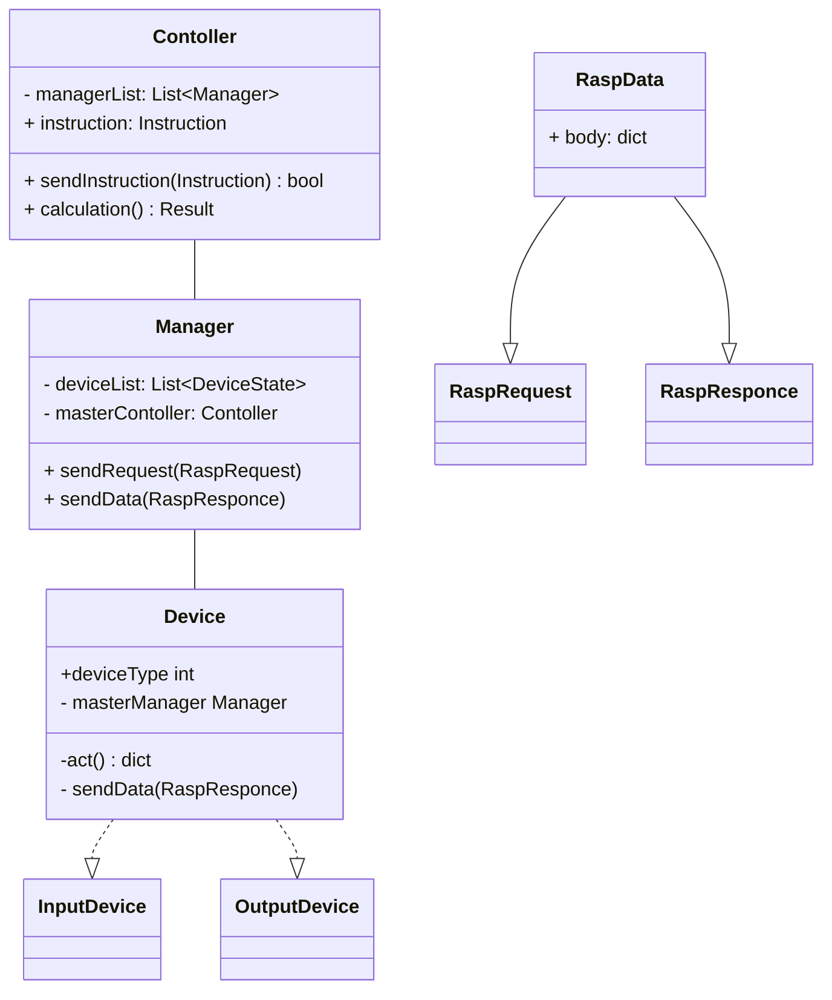

# What's is it?
クラスの構造やプログラム全体のフローを書き残すためのファイル
※プレビューにはmermaidによる図表に対応している必要あり

# クラス構造

```mermaid
classDiagram
    Contoller -- Manager
    Manager -- Device

    Device ..|> InputDevice
    Device ..|> OutputDevice

    RaspData --|> RaspRequest
    RaspData --|> RaspResponce

    class Contoller {
        - managerList: List~Manager~
        + instruction: Instruction

        + sendInstruction(Instruction) bool
        + calculation() Result
    }
    class Manager {
        - deviceList: List~DeviceState~
        - masterContoller: Contoller

        + sendRequest(RaspRequest)
        + sendData(RaspResponce)
    }
    class Device {
        +deviceType int
        - masterManager Manager
        -act() dict
        - sendData(RaspResponce)
    }

    class InputDevice {

    }

    class OutputDevice {

    }

    class RaspData {
        + body: dict
    }

    class RaspRequest {

    }

    class RaspResponce {

    }

```